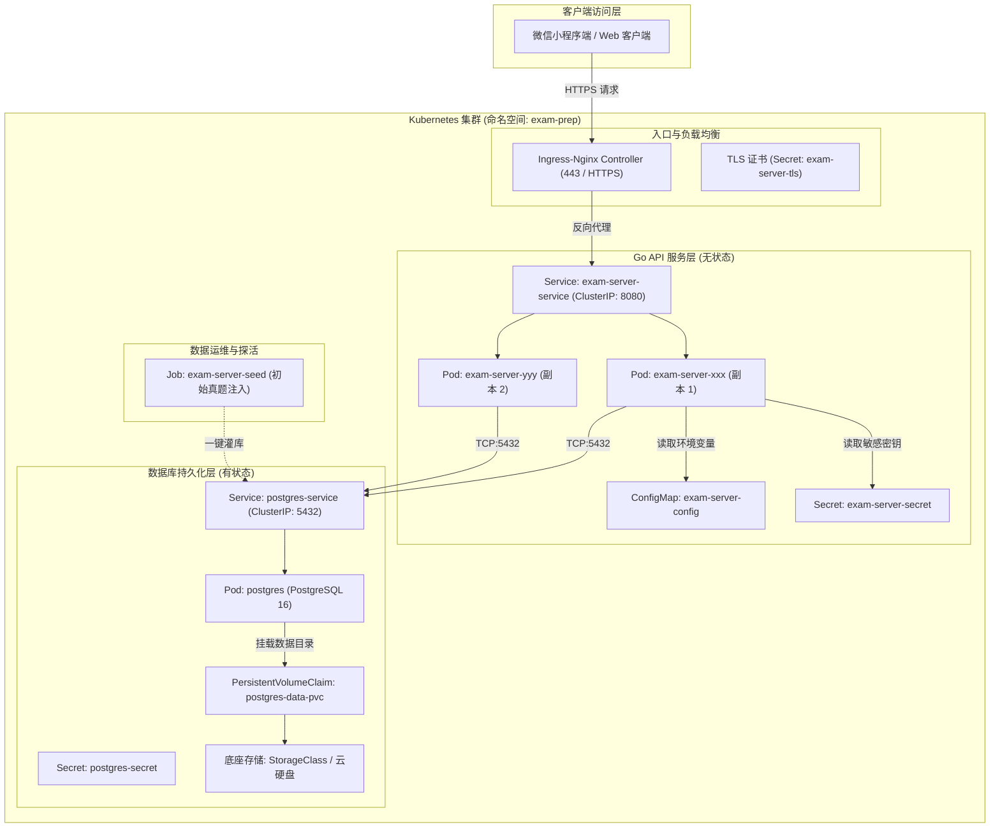

# 智能刷题助手 - Kubernetes 云原生开源部署指南

本项目采用标准云原生（Cloud Native）架构设计，实现了 **Go 后端微服务与 PostgreSQL 数据库的双镜像彻底解耦**，并提供了符合 12-Factor 规范的 Kubernetes 生产级编排清单。

本文档适用于开源社区使用者、DevOps 工程师及独立开发者，涵盖从 Docker 镜像构建到 Kubernetes 集群上线、数据持久化、初始题库注入及域名 HTTPS 配置的全流程。

---

## 一、系统架构拓扑图



---

## 二、部署先决条件 (Prerequisites)

在开始部署前，请确保您已具备以下环境或工具：

1. **容器构建环境**：
   - 安装有 Docker（版本 >= 20.10）或 Podman / buildx。
2. **Kubernetes 集群**：
   - **本地测试**：Minikube、K3s、Kind 或 Docker Desktop Kubernetes。
   - **生产环境**：公有云托管 Kubernetes（如腾讯云 TKE、阿里云 ACK、华为云 CCE、AWS EKS 等），集群版本 >= 1.22。
3. **客户端工具**：
   - `kubectl` 命令行工具，且已正确配置 `~/.kube/config` 并具备集群管理权限。
4. **外部域名与证书（生产环境）**：
   - 微信小程序生产环境强制要求通过 **HTTPS (443端口)** 访问后端，域名需已通过工信部 ICP 备案。

---

## 三、构建与推送 Docker 镜像

项目后端已编写优化过的生产级多阶段构建 `Dockerfile`（二进制体积仅 ~25MB，内置时区与根证书），并内置编译了 `api-server`（API服务）与 `seed`（题库注入工具）。

### 1. 本地快速构建后端镜像

在项目根目录下执行：

```bash
# 构建本地镜像
docker build -t exam-server:latest -f server/Dockerfile server/

# 检查镜像体积与构建状态
docker images | grep exam-server
```

### 2. 推送至镜像仓库 (以阿里云 ACR / Docker Hub 为例)

为便于 Kubernetes 节点拉取镜像，请将镜像推送至您的私有或公共容器镜像仓库：

```bash
# 1. 登录镜像仓库
docker login registry.cn-hangzhou.aliyuncs.com -u your_username

# 2. 为镜像打上版本 Tag (推荐使用语义化版本号)
docker tag exam-server:latest registry.cn-hangzhou.aliyuncs.com/your-namespace/exam-server:v1.0.0
docker tag exam-server:latest registry.cn-hangzhou.aliyuncs.com/your-namespace/exam-server:latest

# 3. 推送镜像
docker push registry.cn-hangzhou.aliyuncs.com/your-namespace/exam-server:v1.0.0
docker push registry.cn-hangzhou.aliyuncs.com/your-namespace/exam-server:latest
```

> **提示**：若使用私有仓库，请在 `deploy/kubernetes/06-server-deployment.yaml` 中添加 `imagePullSecrets`。

---

## 四、Kubernetes 编排清单结构说明

所有编排资源统一保存在 `deploy/kubernetes/` 目录中：

| 文件名 | 资源类型 | 功能说明 |
| :--- | :--- | :--- |
| `00-namespace.yaml` | `Namespace` | 创建业务隔离命名空间 `exam-prep` |
| `01-postgres-secret.yaml` | `Secret` | 存储 PostgreSQL 超级用户、密码与初始数据库名 |
| `02-postgres-pvc.yaml` | `PersistentVolumeClaim` | 申请 10Gi 持久化卷，确保存储重启与升级不丢数据 |
| `03-postgres-deployment.yaml` | `Deployment` + `Service` | 运行 `postgres:16-alpine` 实例及内部 Service 探针 |
| `04-server-configmap.yaml` | `ConfigMap` | 后端运行时非敏感环境变量（端口、模式、数据库连线参数） |
| `05-server-secret.yaml` | `Secret` | 后端核心敏感凭据（JWT密钥、数据库密码、微信AppSecret） |
| `06-server-deployment.yaml` | `Deployment` + `Service` | 后端双副本无状态 Pod、存活探针、就绪探针及资源限额 |
| `07-server-ingress.yaml` | `Ingress` | Nginx Ingress 路由规则与 TLS 证书卸载配置 |
| `08-seed-job.yaml` | `Job` | 运行 `/app/seed` 命令，自动向数据库注入初始官方题库 |
| `kustomization.yaml` | `Kustomization` | 支持 `kubectl apply -k` 一键全量流水线发布 |

---

## 五、快速一键部署指南

### 方法一：使用 Kustomize 一键自动化部署（推荐）

如果使用默认配置，进入项目根目录直接执行：

```bash
# 1. 一键创建命名空间、存储卷、密钥、数据库与后端服务
kubectl apply -k deploy/kubernetes/

# 2. 查看所有 Pod 与资源启动状态
kubectl get all -n exam-prep
```

稍等 30 秒，确认 `postgres` 和 `exam-server` 的 Pod 均处于 `Running` 状态：

```bash
NAME                               READY   STATUS    RESTARTS   AGE
pod/exam-server-7667fc5795-2h8x7   1/1     Running   0          45s
pod/exam-server-7667fc5795-s8m2k   1/1     Running   0          45s
pod/postgres-578b9b8969-7kld2      1/1     Running   0          45s

NAME                          TYPE        CLUSTER-IP       PORT(S)    AGE
service/exam-server-service   ClusterIP   10.96.120.45     8080/TCP   45s
service/postgres-service      ClusterIP   10.105.210.18    5432/TCP   45s
```

---

### 方法二：分步骤精细化部署与核验

适合对网络和密钥有自定义要求的生产环境：

#### 第一步：创建命名空间
```bash
kubectl apply -f deploy/kubernetes/00-namespace.yaml
```

#### 第二步：部署 PostgreSQL 存储卷与数据库
1. （可选）编辑 `deploy/kubernetes/01-postgres-secret.yaml`，修改自定义数据库密码。
2. （可选）编辑 `deploy/kubernetes/02-postgres-pvc.yaml`，指定您的云集群 `storageClassName`。
3. 应用配置并启动数据库：
   ```bash
   kubectl apply -f deploy/kubernetes/01-postgres-secret.yaml
   kubectl apply -f deploy/kubernetes/02-postgres-pvc.yaml
   kubectl apply -f deploy/kubernetes/03-postgres-deployment.yaml
   ```
4. 验证数据库健康探针通过：
   ```bash
   kubectl wait --namespace exam-prep \
     --for=condition=ready pod \
     --selector=app.kubernetes.io/name=postgres \
     --timeout=90s
   ```

#### 第三步：部署 Go 后端服务
1. 编辑 `deploy/kubernetes/06-server-deployment.yaml`，将 `image: exam-server:latest` 修改为您实际推送的镜像地址（例如 `registry.cn-hangzhou.aliyuncs.com/xxx/exam-server:v1.0.0`）。
2. 应用配置并启动后端：
   ```bash
   kubectl apply -f deploy/kubernetes/04-server-configmap.yaml
   kubectl apply -f deploy/kubernetes/05-server-secret.yaml
   kubectl apply -f deploy/kubernetes/06-server-deployment.yaml
   ```
3. 查看后端启动日志：
   ```bash
   kubectl logs -f -n exam-prep -l app.kubernetes.io/name=exam-server --tail=50
   ```

---

## 六、初始化官方题库与考点注入 (Seed)

数据库在首次启动时，Go 服务会自动执行 GORM `AutoMigrate` 生成数据表结构。

您可以选择以下任意一种方式一键灌入官方的 100 道真实考题矩阵：

### 方式 A：运行官方提供的 K8s Job（推荐）
```bash
kubectl apply -f deploy/kubernetes/08-seed-job.yaml
```
查看 Job 执行日志与完成状态：
```bash
kubectl logs -f -n exam-prep -l app.kubernetes.io/component=db-seeder
```
输出显示 `>>> 初始数据填充完成！` 即表示题目已成功入库。

### 方式 B：通过 `kubectl exec` 针对在线 Pod 执行
```bash
kubectl exec -it -n exam-prep deploy/exam-server -- /app/seed
```

---

## 七、公网域名、HTTPS 与 Ingress 配置

微信小程序要求所有请求必须经过合法的 HTTPS 域名。

### 1. 配置 TLS 证书 Secret
将您的 SSL 证书文件（`tls.crt` 和 `tls.key`）导入集群：
```bash
kubectl create secret tls exam-server-tls \
  --cert=path/to/your_domain.crt \
  --key=path/to/your_domain.key \
  -n exam-prep
```

### 2. 部署 Ingress
1. 打开 `deploy/kubernetes/07-server-ingress.yaml`，将 `api.exam.example.com` 替换为您的实际业务域名。
2. 应用 Ingress 规则：
   ```bash
   kubectl apply -f deploy/kubernetes/07-server-ingress.yaml
   ```
3. 外部测试验证接口连通性：
   ```bash
   curl -i https://api.exam.example.com/health
   # 预期返回: {"service":"exam-server","status":"ok"}
   ```

---

## 八、小程序前端配置对接

当 Kubernetes 后端部署完成并配置 HTTPS 后：

1. 打开微信小程序源码根目录下的 [`config.js`](file:///d:/Projects/%E6%99%BA%E8%83%BD%E5%88%B7%E9%A2%98%E5%8A%A9%E6%89%8B/config.js)。
2. 将 `API_BASE_URL` 改为集群公网地址：
   ```javascript
   const CONFIG = {
     // 替换为您的 Kubernetes 生产入口地址
     API_BASE_URL: 'https://api.exam.example.com',
     USE_MOCK: false,
     TIMEOUT: 15000
   };
   module.exports = CONFIG;
   ```
3. 在 [微信公众平台 (mp.weixin.qq.com)](https://mp.weixin.qq.com) ->「开发管理」->「开发设置」->「服务器域名」中：
   - 将 `https://api.exam.example.com` 添加至 **request 合法域名** 列表。

---

## 九、常用运维与排障手册 (Troubleshooting)

### 1. 集群就地冒烟探活 (E2E Test)
后端镜像内预置了 `/app/e2e` 集成测试工具，可在集群内直接运行，全面检验数据库读写、事务与各业务接口：
```bash
kubectl exec -it -n exam-prep deploy/exam-server -- /app/e2e -url=http://127.0.0.1:8080
```

### 2. 数据库备份与导出
通过 `kubectl exec` 将 PostgreSQL 数据导出为 SQL 备份文件：
```bash
kubectl exec -n exam-prep deploy/postgres -- pg_dump -U equiz_user equiz_db > backup_$(date +%Y%m%d).sql
```

### 3. 查看实时服务日志
```bash
# 查看所有 API Pod 的合并日志流
kubectl logs -f -n exam-prep -l app.kubernetes.io/name=exam-server --max-log-requests=5
```

### 4. 常见问题排查表

| 现象 | 可能原因 | 解决办法 |
| :--- | :--- | :--- |
| **PVC 处于 `Pending`** | 集群未设置默认 StorageClass | 检查 `kubectl get sc`，并在 `02-postgres-pvc.yaml` 中显式指定 `storageClassName` |
| **后端报 `dial tcp: lookup postgres-service: no such host`** | CoreDNS 未就绪或跨命名空间未匹配 | 确保在同一 `exam-prep` 命名空间，检查 `kubectl get pods -n kube-system -l k8s-app=kube-dns` |
| **微信开发者工具报 `不在以下合法域名列表中`** | 微信平台未加入白名单或本地未跳过校验 | 开发测试期在开发者工具右上角「详情」勾选「不校验合法域名」，生产时加入白名单 |
| **上传 Excel 题库报 413 Request Entity Too Large** | Ingress 限制请求体体积 | 检查 `07-server-ingress.yaml` 中的 `proxy-body-size: "50m"` 是否已生效 |
